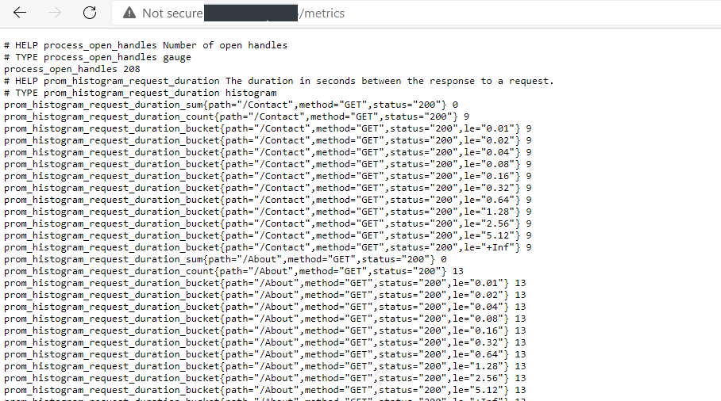

# Pre-aggregated Metrics - .NET Core app with Prometheus and Azure Monitor

- [Pre-aggregated Metrics - .NET Core app with Prometheus and Azure Monitor](#pre-aggregated-metrics---net-core-app-with-prometheus-and-azure-monitor)
  - [Overview](#overview)
  - [Getting Started](#getting-started)
    - [Prerequisites](#prerequisites)
    - [Quickstart - Run App Locally](#quickstart---run-app-locally)
    - [Deploy Application to Azure Kubernetes Service to Collect Metrics](#deploy-application-to-azure-kubernetes-service-to-collect-metrics)
    - [Install the Prometheus Server](#install-the-prometheus-server)
  - [Prometheus scraping with Azure Monitor](#prometheus-scraping-with-azure-monitor)
  - [Pod Annotations for Scraping](#pod-annotations-for-scraping)
  - [Run the Application and Collect Metrics](#run-the-application-and-collect-metrics)
  - [Optionally Install Grafana](#optionally-install-grafana)
    - [Setup Configuration on Grafana](#setup-configuration-on-grafana)
  - [Resources](#resources)

## Overview

Sample .NET Core Web app that demonstrates different implementations for pre-aggregated metrics using the following:

- The Application Insights .NET Core SDK and method GetMetric to populate CustomMetrics
- The prometheus-net .NET library to export Prometheus metrics
- Agent configuration so that Prometheus metrics are scraped with Azure Monitor to populate Container logs InsightsMetrics
- A Prometheus server that is installed on the cluster and configured to collect metrics from all pods
- The RequestMiddleware.cs class in the sample application contains the metrics configuration for both Prometheus and GetMetric

## Getting Started

### Prerequisites

- [Azure CLI](https://docs.microsoft.com/en-us/cli/azure/install-azure-cli?view=azure-cli-latest): Create and manage Azure resources.
- [Kubectl](https://kubernetes.io/docs/tasks/tools/install-kubectl/): Kubernetes command-line tool which allows you to run commands against Kubernetes clusters.
- [Helm](https://helm.sh/docs/intro/install/): Package manager for Kubernetes
- [GitHub](https://github.com/) account

### Quickstart - Run App Locally

Verify that the sample application is able to run locally. In order to collect metrics, please continue to the [next section](#deploy-application-to-azure-kubernetes-service-to-collect-metrics) to deploy the app to AKS.

1. Fork [this repo](https://github.com/Azure-Samples/dotnetapp-azure-prometheus/) to your github account and git clone
2. cd `dotnetapp-azure-prometheus/Application`
3. Run `docker-compose up` and go to <http://localhost:8080> to interact with the application.

### Deploy Application to Azure Kubernetes Service to Collect Metrics

1. Create a resource group that will hold all the created resources and a service principal to manage and access those resources

    ```bash
    # Set your variables
    RESOURCEGROUPNAME="MyResourceGroup"
    LOCATION="MyLocation"
    SUBSCRIPTIONID="MySubscriptionId"
    SERVICEPRINCIPAL="MySPName"

    # Create resource group
    az group create --name $RESOURCEGROUPNAME --location $LOCATION

    # Create a service principal with Contributor role to the resource group
    az ad sp create-for-rbac --name $SERVICEPRINCIPAL --role contributor --scopes /subscriptions/$SUBSCRIPTIONID/resourceGroups/$RESOURCEGROUPNAME --sdk-auth
    ```

2. Use the output of the last command as a secret named `AZURE_CREDENTIALS` in the repository settings. For more details on generating the deployment credentials please see [this guide](https://docs.microsoft.com/en-us/azure/azure-resource-manager/templates/deploy-github-actions#generate-deployment-credentials)

3. [Github Actions](https://docs.github.com/en/actions) will be used to automate the workflow and deploy all the necessary resources to Azure. Open the [.github\workflows\devops-starter-workflow.yml](.github\workflows\devops-starter-workflow.yml) and change the environment variables accordingly. Use the `RESOURCEGROUPNAME` and `SUBSCRIPTIONID` values that you created above.

4. Commit your changes. The commit will trigger the build and deploy jobs within the workflow and will provision all the resources to run the sample application.

### Install the Prometheus Server

```bash

# Define variables
RESOURCE_GROUP="<insert-resource-group-name-here>"
CLUSTER_NAME="<insert-cluster-name-here>"
NAMESPACE="<insert-application-namespace-name-here>"

# Connect to Cluster
az aks get-credentials --resource-group $RESOURCE_GROUP --name $CLUSTER_NAME

# Set the default namespace to the application namespace
kubectl config set-context --current --namespace=$NAMESPACE

helm repo add stable https://charts.helm.sh/stable 

helm repo add prometheus-community https://prometheus-community.github.io/helm-charts

helm repo add kube-state-metrics https://kubernetes.github.io/kube-state-metrics

helm repo update

helm install my-prometheus prometheus-community/prometheus --set server.service.type=LoadBalancer --set rbac.create=false

# Verify the installation by looking at your services 
kubectl get services

# Connect your service with Prometheus 
helm upgrade my-prometheus prometheus-community/prometheus --set server.service.type=LoadBalancer --set rbac.create=false -f Application/manifests/prometheus.values.yaml
```

## Prometheus scraping with Azure Monitor

For Prometheus scraping with Azure Monitor, a Prometheus server is not required. The configMap `container-azm-ms-agentconfig.yaml`, enables scraping of Prometheus metrics from each pod in the cluster and has been configured according to the following:

```yml
prometheus-data-collection-settings: |- 
# Custom Prometheus metrics data collection settings
[prometheus_data_collection_settings.cluster] 
interval = "1m"
# Metrics for Prometheus scraping
fieldpass=["prom_counter_request_total", "prom_histogram_request_duration", "prom_summary_memory", "prom_gauge_memory"]
monitor_kubernetes_pods = true 
```

Run the following command to apply this configMap configuration to the cluster:

```bash
kubectl apply -f Application/manifests/container-azm-ms-agentconfig.yaml
```

## Pod Annotations for Scraping

To configure Prometheus to collect metrics from all pods the following annotations were added to the app [deployment.yaml](Application/charts/sampleapp/templates/deployment.yaml)

```yml
annotations:
  prometheus.io/scrape: 'true'
  prometheus.io/port: '80'
```

## Run the Application and Collect Metrics

1. Get the IP addresses of the sampleapp and the prometheus-server:

    ```bash
    kubectl get services sampleapp
    ```

2. Load the sampleapp endpoint and interact with the menu items (Home, About, Contact). Pre-aggregated metrics are configured and collected using:

    - **CustomMetrics**: Implementation of metrics using the AppInsights .NET Core SDK and `TelemetryClient.GetMetric`:

      

    - **Prometheus metrics**: Implementation of Prometheus metrics using the [prometheus-net](https://github.com/prometheus-net/prometheus-net) .NET library and the `/metrics` endpoint:

      

    - **InsightsMetrics**: Agent configuration for scraping Prometheus metrics with Azure Monitor:

      

    - **Prometheus Server**:
      - Get the prometheus server IP address:

        ```bash
        kubectl get services my-prometheus-server
        ```

      - Load the prometheus server endpoint. The cluster is configured to collect metrics from all pods:

        

## Optionally Install Grafana

Grafana can be optionally installed to visualize the web application data and metrics collected once connected with the data source.

```bash
helm repo add grafana https://grafana.github.io/helm-charts

helm repo update 

helm install my-grafana grafana/grafana  --set rbac.create=false --set service.type=LoadBalancer  --set persistence.enabled=true

# Verify
kubectl get services 

```

### Setup Configuration on Grafana

1. Get the IP address of the Grafana Dashboard
2. Login with user `admin`. Get the password:

    ```bash
    kubectl get secret my-grafana -o jsonpath="{.data.admin-password}" | base64 --decode ; echo
    ```

3. Follow the [setup guide](https://medium.com/faun/monitoring-with-prometheus-and-grafana-in-kubernetes-42727866562c) to get a starter dashboard for Kubernetes

## Resources

- [Custom metrics in .NET Core with GetMetric](https://docs.microsoft.com/en-us/azure/azure-monitor/app/get-metric)
- [Prometheus](https://prometheus.io/docs/prometheus/latest/)
- [Metric types in Prometheus](https://prometheus.io/docs/concepts/metric_types)
- [Prometheus scraping with Azure Monitor](https://docs.microsoft.com/en-us/azure/azure-monitor/containers/container-insights-prometheus-integration#query-prometheus-metrics-data)
